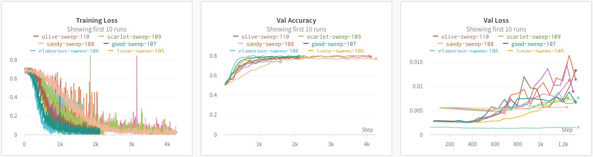
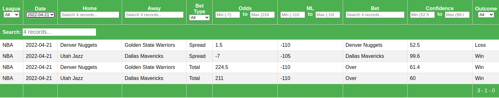

# Sports Betting
This project uses machine learning to predict the outcome of common bets (Spread, Moneyline, Total) in four sports leagues (NFL, NBA, College Football, College Basketball).
See the latest predictions [here](https://personal-website-app-gfrfw.mongodbstitch.com/sports-betting/).

  

## Contents

[1. Data Collection](#Data-Collection)\
[2. Data Cleaning](#Data-Cleaning)\
[3. Modeling](#Modeling)\
[4. Agents](#Agents)\
[5. Frontend](#Frontend)

<!-- TODO link to the specific scraping README, do the same for other sections -->
## [1. Data Collection](Data_Collection/README.md)
This project focuses on four leagues: NFL, NBA, NCAAF, and NCAAB. The following sections describe how data was collected from each source.

### ESPN
<!-- teams, rosters, schedule, game, player stats, players -->
There are 6 ESPN web scrapers to collect [team data](/Data_Collection/espn_teams.py), [rosters](/Data_Collection/espn_rosters.py), [schedules](/Data_Collection/espn_schedule.py), [game stats](/Data_Collection/espn_game.py), [player stats](/Data_Collection/espn_player_stats.py), and [player information](/Data_Collection/espn_players.py).
All data is saved to [/Data/ESPN/](/Data/ESPN/).

- Team data includes the team name and links to pages for that team on ESPN (roster, stats, schedule, etc).
- Roster data includes all players and their ESPN ID for each team. This is used to keep track of which team players are on at a given time.
- Schedule data includes the date and ESPN ID for every game.
- After the schedule data is scraped, the espn game scraper scrapes the actual stats from each completed game.
- The ESPN player stats scraper also scrapes each individual player's stats from each game.
- Finally, the espn player scraper simply scrapes attributes about each player like height and weight from their bio page on ESPN.

### Sportsbook Reviews Online
The [Sportsbook Reviews Online scraper](/Data_Collection/sbo.py) collects odds data from [sportsbookreviewsonline.com](https://www.sportsbookreviewsonline.com/).
This data includes the spread, moneyline, and totals odds for games in all leagues since 2007.
The data is saved to [/Data/Odds/](/Data/Odds/).

### Elite Sportsbook
Unfortunately, the Sportsbook Reviews Online data does not include odds for upcoming games.
Therefore, I created the [Elite Sportsbook scraper](/Data_Collection/esb.py) to scrape the odds for upcoming games from [elitesportsbook.com](https://www.eliteportsbook.com), an online sportsbook based in Iowa.

### Covers.com
Injuries can be a huge factor in sports.
Therefore, I wrote the [Covers injury scraper](/Data_Collection/covers.py) to scrape injury data from [covers.com](https://www.covers.com/).
Each player's injury status is given to the models as input data, and when a player is out, their data is omitted entirely.

## [2. Data Cleaning](/Data_Cleaning/)

### ESPN
The ESPN web scrapers store the raw data from the website, but that isn't always in a clean format for machine learning.
The [clean ESPN script](/Data_Cleaning/clean_espn.py) reformats the data into a format that is easy to work with.
For example, it takes stats with dashes like 10-12 free throws, and converts it to 10 free throws made and 12 free throws attempted.
This cleaned data is saved to [/Data/ESPN/](/Data/ESPN/) (outside the league folders).

### Sportsbook Reviews Online
Similarly, the Sportsbook Reviews Online data is not in a clean format for machine learning.
This data is downloaded as .xlsx files, which represent each game's bets in two rows.
The [clean SBO script](/Data_Cleaning/clean_sbo.py) reformats each game into one row, with cleaned values.

### Matching Teams and Players
Since this project uses multiple data sources, sometimes the sources use different names for teams and players (e.g. "LA Chargers" and "Los Angeles Chargers").
I use the names from ESPN as the "correct" names, and edit names from other sources to match ESPN for consistency.
The [match teams script](/Data_Cleaning/match_teams.py) matches the team names from non-ESPN sources to the names from ESPN.
The alternate names are saved to the [team JSON files](/Data/Teams/) in the "Other Names" field.

### Merging Datasets
Once all the data is collected and cleand, the [merge datasets script](/Data_Cleaning/merge_datasets.py) merges the cleaned data from all sources.
These datasets are saved in [/Data/](/Data/).

### Labeling Predictions
After predictions are made by the models and agents, the [label predictions script](/Data_Cleaning/label_predictions.py) and [label agents script](/Data_Cleaning/label_agents.py) label the predictions with the true result.

## [3. Modeling](/Modeling/)

### Weights and Biases setup
To monitor each model as it trains, I use [Weights and Biases](https://wandb.com) to track metrics like loss and accuracy.

Inside my training code, I simply send metrics to Weights and Biases, and they create a dashboard of with graphs like this:

  

### Training Models
Before training the models, I split the data into train/validation/test sets of 70%/15%/15%.
The validation and test sets have a disproportionate amount of recent games, to mimic the task of predicting upcoming games.

The [train models file](/Modeling/train_models.py) runs a Weights and Biases "Sweep" to train and evaluate many models on the validation set to find the best hyperparameters.
The possible hyperparameter values are stored in the [sweep yaml file](/Modeling/sweep.yaml).
The models are evaluated using binary cross entropy.

The hyperparameters from each model in the sweep are saved to a csv in the [sweeps folder](/Modeling/Sweeps/), along with the lowest loss achieved.

### Running Models
After running many sweeps of hyperparameters (~100), the best 10 are retrained and evaluated on the test set. Those models are then used in an ensemble to make the final predictions on upcoming games.

### Alternate Predictions
Betting odds often change leading up to a game, which impact the AI's predictions.
Therefore, I also ran the models with [different odds values](/Modeling/alt_odds.py) to show how they would behave if the odds did change.

## [4. Agents](/Agents/)

Agents use rules-based methods to make bets with the models' predictions.
They're created to give a more realistic measure of how useful the models are.

<!-- ### Baseline -->

### Flat
The [flat betting agent](/Agents/flat.py) simply wagers $10 on every predicted bet.
Whether the models are strongly in favor of the outcome or on the fence, this agent will bet the same amount every time.

### Dynamic
The [dynamic betting agent](/Agents/dynamic.py) wagers more money when the models are more confident.
This agent can place anywhere from $5 to $15 on each bet.

## [5. Frontend](/Frontend/)

All predictions and agent bets made in this project can be seen [here](https://personal-website-app-gfrfw.mongodbstitch.com/sports-betting/).
This site is a simple [React](https://reactjs.org/) app that uses [MongoDB](https://www.mongodb.com/) and to store predictions and [React-Table](https://react-table.tanstack.com/) to display the data.

  

