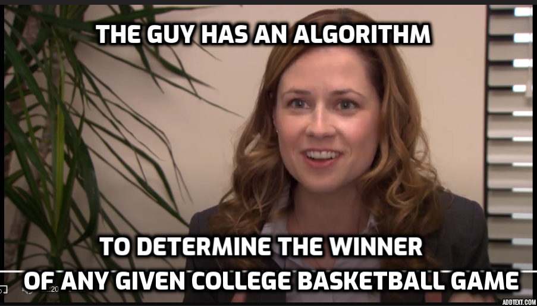

# Sports Betting
This project evaluates multiple AI algorithms' effectiveness in predicting the outcome of football and basketball bets.
The algorithms are trained on a database of team stats and odds for each game dating back to 2007.



## Contents

[1. Data Collection](#Data-Collection)\
[2. Data Cleaning](#Data-Cleaning)\
[3. Modeling](#Modeling)\
[4. Performance](#Performance)\
[5. Using this Repository](#Using-this-Repository)


<a name="Data-Collection"></a>

<!-- TODO link to the specific scraping README, do the same for other sections -->
## [1. Data Collection](Data_Collection/)
This project focuses on four leagues: NFL, NBA, NCAAF, NCAAB. The following sections describe how the data was collected.


<a name="Data-Cleaning"></a>

## [2. Data Cleaning](/Data_Cleaning/)


<a name="Modeling"></a>

## [3. Modeling](/Modeling/)

stuff


<a name="Performance"></a>

## 4. Performance

### Win Percentage


### Expected Value


### Performance Relative to Confidence


### Production Performance


<a name="Using-this-Repository"></a>

## 5. Using This Repository

```
$ git clone https://github.com/DillonKoch/Sports_Betting.git
```


### Creating an Environment


### Running Web Scrapers
```
python espn_game.py
```


### Training Models
